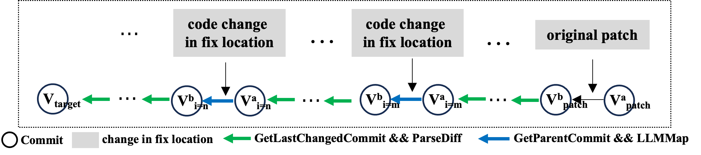

**Symbol explanation:**

We introduce a variable $i$ to refer to different $V_{after}$ and $V_{before}$ encountered during the backtracing process. Assuming that there are multiple code changes to the fix location throughout the code history, we define the commits as follows: the commit immediately after the $i$-th code change is denoted $V^a_{i}$, the commit immediately before the $i$-th code change is $V^b_{i}$, the commit right before the original patch is $V^b_{patch}$, the commit right after the original patch is $V^a_{patch}$, and the target version is $V_{target}$.

**Here is a clearer version of the localization process using new symbols:**

Our localization method backtraces code changes to track the fix location via code history, mapping lines between commits surrounding the code changes. Starting from $V^b_{patch}$, we use `git blame` (`GetLastChangedCommit`) to find the nearest commit $V^a_{i=1}$ that **modifies** the fix location code. We then map the fix location from $V^b_{patch}$ to $V^a_{i=1}$ using `ParseDiff`. Since $V^a_{i=1}$ modifies the fix locaiton code based on its parent commit $V^b_{i=1}$, we map the code change to $V^b_{i=1}$ using `LLMMap`. We then continue to use `git blame` on $V^b_{i=1}$ to find the next code change $V^a_{i=2}$, repeating the process until we identify the fix location in $V_{target}$.

